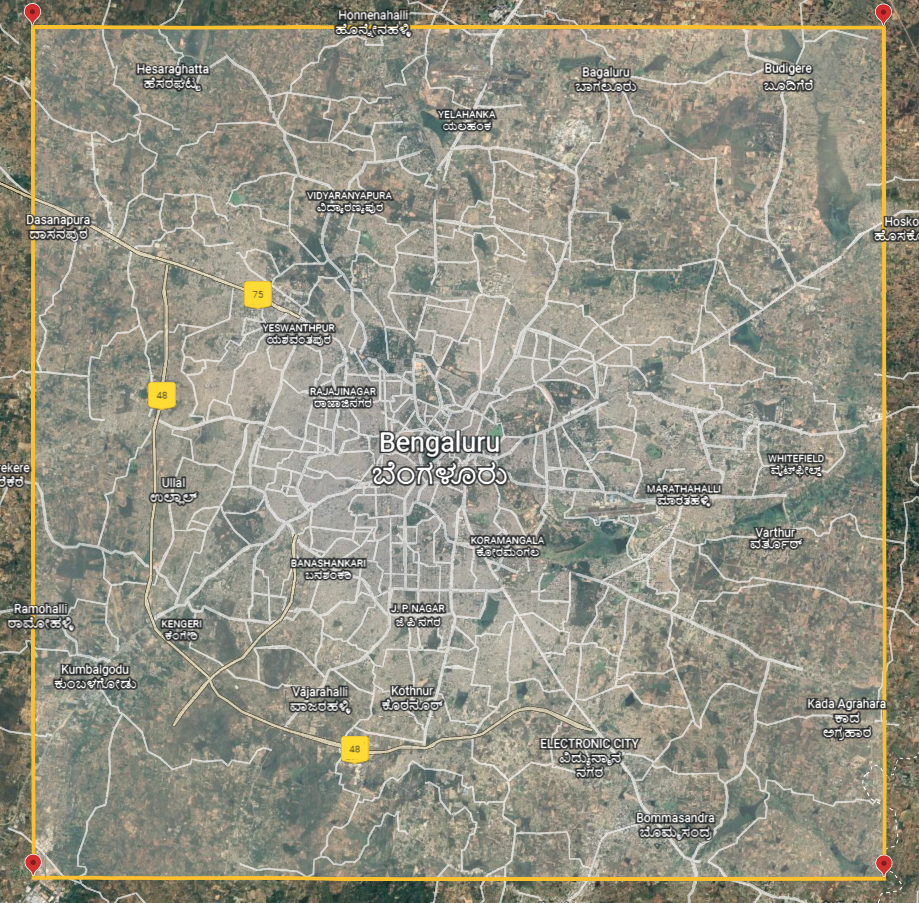

# CNI hackthon
This repo is a recreation of the datascience task asked in CNI hackthon 2022  
More details on : https://www.cnihackathon.in/

## Problem definition
### Background
- We have a dataset containing information about the buses travelling in Bengaluru. We have obtained it from Bengaluru Metropolitan Transport Corporation (BMTC).
- The region of interest is an approximately 40km by 40km square area. See the following figure:  

- The data was collected from around two thousand buses for one day, between 7:00am to 7:00pm.
- The buses follow different routes within the city.
- Each bus is identified with a unique ID. A bus carries a device which records the data: latitude, longitude, speed, and timestamp.
### Task
Create a model to estimate the travel time, in minutes, between source-destination pairs using the provided dataset.
### Submission
**Build EstimatedTravelTime() within Predict.py**
```py
"""
This Python code snippet serves two purposes:
1. illustrates how to use relative path
2. provides the template for code submission
ASSUMPTION: 
1. This Python code is present in the folder 'srika_DS_456AB'.
2. BMTC.parquet.gzip, Input.csv, and GroundTruth.csv are present in the folder 'data'
"""
import pandas as pd
# import other packages here
from math import radians, cos, sin, asin, sqrt

"""
ILLUSTRATION: HOW TO USE RELATIVE PATH
Given the above mentioned assumptions, when you run the code, the following three commands will read the files 
containing data, input and, the ground truth.
"""
df = pd.read_parquet('./../data/BMTC.parquet.gzip', engine='pyarrow') # This command loads BMTC data into a dataframe. 
                                                                      # In case of error, install pyarrow using: 
                                                                      # pip install pyarrow
dfInput = pd.read_csv('./../data/Input.csv')
dfGroundTruth = pd.read_csv('./../data/GroundTruth.csv') 
# NOTE: The file GroundTruth.csv is for participants to assess the performance their own codes

"""
CODE SUBMISSION TEMPLATE
1. The submissions should have the function EstimatedTravelTime().
2. Function arguments:
    a. df: It is a pandas dataframe that contains the data from BMTC.parquet.gzip
    b. dfInput: It is a pandas dataframe that contains the input from Input.csv
3. Returns:
    a. dfOutput: It is a pandas dataframe that contains the output
"""
def EstimatedTravelTime(df, dfInput): # The output of this function will be evaluated
    # Function body - Begins
    # Make changes here.
    dfOutput = pd.DataFrame()


    # Function body - Ends
    return dfOutput 
  
"""
Other function definitions here: BEGINS
"""

"""
Other function definitions here: ENDS
"""

dfOutput = EstimatedTravelTime(df, dfInput)
```
## Data Exploration
### observing the data format

Top 5 entries of `BMTC.parquet.gzip`


| BusID     | Latitude  | Longitude | Speed | Timestamp            |
|-----------|-----------|-----------|-------|----------------------|
| 150212121 | 13.074558 | 77.445549 | 0.0   | 2019-08-01 07:00:02  |
| 150212121 | 13.074558 | 77.445549 | 0.0   | 2019-08-01 07:00:12  |
| 150212121 | 13.074558 | 77.445549 | 0.0   | 2019-08-01 07:00:22  |
| 150212121 | 13.074558 | 77.445549 | 0.0   | 2019-08-01 07:00:32  |
| 150212121 | 13.074558 | 77.445549 | 0.0   | 2019-08-01 07:00:42  |

`Statistics`

|           | BusID      | Latitude   | Longitude  | Speed      |
|-----------|------------|------------|------------|------------|
| count     | 6,014,946  | 6,014,946  | 6,014,946  | 6,014,946  |
| mean      | 150,422,700| 12.96631   | 77.60581   | 11.10418   |
| std       | 280,376.9  | 0.06350863 | 0.07185203 | 13.97228   |
| min       | 150,212,100| 12.7944    | 77.41818   | 0.0        |
| 25%       | 150,220,100| 12.92179   | 77.56099   | 0.0        |
| 50%       | 150,221,900| 12.96695   | 77.59363   | 5.0        |
| 75%       | 150,810,900| 13.00248   | 77.65333   | 20.0       |
| max       | 150,813,400| 13.15513   | 77.78835   | 120.0      |
 

`input.csv`
|    | Source_Lat | Source_Long |  Dest_Lat  |  Dest_Long |
|----|------------|-------------|------------|------------|
| 0  |  12.941644 |  77.557335  | 12.942002 |  77.551605 |
| 1  |  12.845487 |  77.662079  | 12.845881 |  77.667892 |
| 2  |  12.973492 |  77.622871  | 12.957303 |  77.621246 |
| 3  |  12.819298 |  77.688995  | 12.814241 |  77.692986 |
| 4  |  12.973240 |  77.615402  | 13.016170 |  77.627800 |

`GroundTruth.csv`
|    |      TT     |
|----|------------|
| 0  |  2.833333  |
| 1  |  1.500000  |
| 2  | 21.250000  |
| 3  |  2.000000  |
| 4  | 35.733333  |

### Data Visualization

The attached screen shots are created with the help of [Tableau](https://www.tableau.com/products/desktop) and some in python.  
**A scatter plot on latitude and longitude**


**Specefic bus routes**


**Speed distribution of Buses**


**Bus speed count**  
Annotation shows that with speed of 5.0, there is 101,885 entries in the dataset with 1919 uniques buses reaches this speed


**Time series of bus speed**
This plot shows the time series of bus speed.  


**Bus stop location**
This plot shows the bus stop location, which is source-destination pairs from Input.csv.


**Plot of high speed buses**
This plot shows the high speed buses, latitude and longitude of buses that reaches speed above 80.0.


**Plot of medium speed buses**
This plot shows the medium speed buses, latitude and longitude of buses that reaches speed between 40.0 and 80.0.
